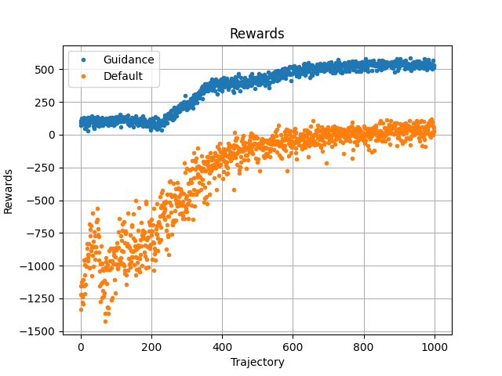

# Plan
1. Train several models
    * Without guidance
    * With guidance
2. Save all rewards logs in files to compare processes
    * name could be something like guidance-rewards-{date-time}.txt
3. Eval all models on several trajectories
4. Plot median rewards
5. Show win rate

# Summary

## Rewards

RU: Использование ограничения действий сильно ускорило процесс обучения модели.
Награды агента с улучшением всегда положительны и обгоняют награды обычного агента.
Ниже представлены усреднённые графики наград агентов с модификацией (guidance) и без (default).

Для лучшего понимания улучшений проанализируем количество побед агентов.
Агенты обучались выплачивать долг и накапливать запас лояльности и пользователей.
После выплаты долга игра доигрывалась пустыми спринтами, так как это одна из эффективных стратегий.

Количество побед обычного алгоритма при каждом запуске обучения. (Сыграно 100 траекторий)

[0. 0. 0. 0. 0. 0. 0. 0. 0. 0. 0.]

Количество побед агента с модификацией:

[13.  2.  1.  2.  1. 13. 25.  6. 24.  2. 13.]

Видно значительное различие между агентами.
Это можно объяснить тем, что агент с модификацией не тратил время на бесполезные ходы.
Таким образом агент смог увидеть большее количество разнообразных состояний игры за то же время обучения.
